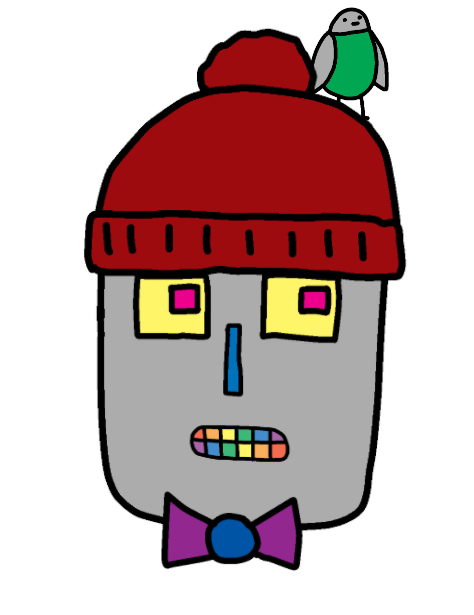

# Absolute Position: Make A Robot

The robot's face has fallen off!

Use CSS to help glue the face back together.

## Instructions

*  Edit the **style.css** to move the images onto the robot's face.
*  Use the `position`, `top`, `left`, and `width` properties to arrange the images.
*  See the example CSS that moves the image with `id="crown"` onto the robot's head.
*  **Be creative**!
  
Your final webpage should look something like this:

But you can put the items wherever you like.

Share an image of your robot when you're finished!